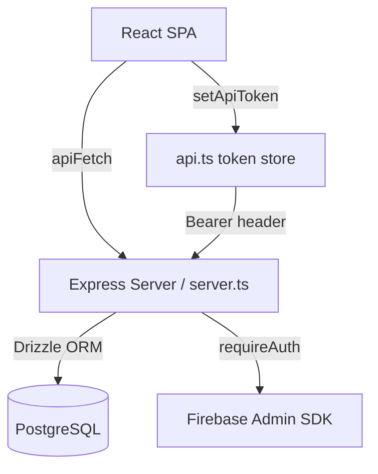

# Design Document: AQS Phase 2 Core Functionality

## Overview

This document describes the technical design for the AQS Phase 2 changes. The work falls into five cohesive tracks:

1. **Server API additions** — `/api/health`, `POST /api/courses/:id/complete`, `POST /api/enrollments`, `GET /api/enrollments`
2. **Analytics N+1 fix** — rewrite `GET /api/admin/analytics` to use 4 bulk queries and fix the completion-rate formula
3. **Frontend API hygiene** — wire `setApiToken` in `App.tsx` and replace raw `fetch()` with `apiFetch` in four components
4. **Offline sync reliability** — integrate `withBackoff` into `BannerOffline`
5. **Enrollment persistence** — Drizzle schema addition, SQL migration, and cross-device sync in `App.tsx`

All changes are additive or in-place rewrites; no existing API response shapes are altered.

---

## Architecture

The platform follows a single-server architecture: an Express backend (`server.ts`) serves both the REST API and the Vite SPA. The frontend communicates exclusively via HTTP using the centralised `apiFetch` wrapper.



After Phase 2, every outbound HTTP call from the SPA travels through `apiFetch`, which reads the token set by `setApiToken`. The token is refreshed automatically on 401 by `apiFetch` itself.

---

## Components and Interfaces

### 1. `GET /api/health` (server.ts)

Registered as the **first** route. No authentication required.

```
Response 200: { status: 'ok', db: 'connected', timestamp: string }
Response 503: { status: 'error', db: 'disconnected' }
```

Implementation: executes `sql\`SELECT 1\``via the Drizzle`db` instance. On success → 200; on any error → 503.

---

### 2. `POST /api/courses/:id/complete` (server.ts)

Protected by `requireAuth`. Delegates all business logic to the existing `completeCourse` service.

```
Request: (no body required — user identity comes from requireAuth)
Response 200: { success: true, completionId: string, completedAt: string }
Response 400: { error: string }   — invalid courseId
Response 422: { error: string }   — conditions not met (from completeCourse throw)
```

The `completeCourse` function already handles idempotency via the `(userId, courseId)` unique constraint on `course_completions`.

---

### 3. `GET /api/admin/analytics` — bulk-query rewrite (server.ts)

Current implementation runs nested per-learner per-course loops, producing O(L × C) database queries. The rewrite uses exactly 4 queries then computes all stats in memory.

**Query plan:**

| #   | Query                              | Purpose                             |
| --- | ---------------------------------- | ----------------------------------- |
| 1   | `SELECT * FROM users`              | Learner list + `totalLearnersCount` |
| 2   | `SELECT * FROM lessons`            | Lesson counts per course            |
| 3   | `SELECT * FROM lesson_completions` | Completed lesson sets per user      |
| 4   | `SELECT * FROM quiz_attempts`      | Quiz scores per user                |

Courses are fetched as part of the existing query or reused from query 1's join — the implementation may fold courses into a single `SELECT * FROM courses` bulk fetch as query 0.5 (still well within the "4 bulk" intent; courses + users + lessons + completions + attempts = 5 queries maximum, all bulk).

**Completion rate formula (corrected):**

```
completionRate = Math.round((passedQuizzes / totalLearnersCount) * 100)
```

where `passedQuizzes` = number of learners with at least one passing attempt for this course's quiz, and `totalLearnersCount` = total learner user count (not just active students).

Response shape is **unchanged**.

---

### 4. `BannerOffline.tsx` — withBackoff integration

Replace the ad-hoc `fetch('/api/sync', ...)` call with:

```typescript
import { withBackoff } from '../server/services/sync-service.ts';
import { apiFetch } from '../lib/api.ts';

await withBackoff(
  () => apiFetch('/api/sync', { method: 'POST', ... }),
  {
    onRetry: (attempt, _err) =>
      setSyncMessage(`Retrying sync… attempt ${attempt + 1}`),
  }
);
```

On final failure (thrown after all retries) the component catches the error and sets an error state displayed to the user.

---

### 5. `LearnerCoursePlayer.tsx` — completion banner

Add a derived boolean `showCompletionBanner = allLessonsCompleted && isQuizPassed`. When truthy, render a congratulations banner. A `useEffect` keyed on `showCompletionBanner` fires when it becomes `true`, calls `POST /api/courses/${courseId}/complete` via `apiFetch`, and stores the returned `completedAt` in component state for display.

---

### 6. `App.tsx` — token propagation

```typescript
import { setApiToken } from './lib/api.ts';

useEffect(() => {
  setApiToken(token);
}, [token]);
```

This single effect ensures `apiFetch` always holds the current token, including after Firebase silent refresh.

---

### 7. Raw fetch() → apiFetch migration

| File                      | Change                                                 |
| ------------------------- | ------------------------------------------------------ |
| `BannerOffline.tsx`       | Replace `fetch('/api/sync', ...)` with `apiFetch(...)` |
| `CourseFactory.tsx`       | Replace all admin CMS fetch calls with `apiFetch(...)` |
| `AnalyticsDashboard.tsx`  | Replace analytics fetch call with `apiFetch(...)`      |
| `LearnerCoursePlayer.tsx` | Replace lesson/quiz fetch calls with `apiFetch(...)`   |

`src/lib/utils.ts` is **not changed**; `authHeaders`/`jsonHeaders` remain for LessonManager and QuizBuilder.

---

### 8. `POST /api/enrollments` and `GET /api/enrollments` (server.ts)

Both routes require `requireAuth`.

**POST /api/enrollments**

```
Body: { courseId: number }
Response 200: { success: true, courseId: number }
Response 400: { error: string }   — missing/invalid courseId
```

Insert using `ON CONFLICT (user_id, course_id) DO NOTHING` for idempotency.

**GET /api/enrollments**

```
Response 200: { courseIds: number[] }
```

Queries `SELECT course_id FROM enrollments WHERE user_id = ?`.

---

### 9. Drizzle schema — enrollments table (src/db/schema.ts)

```typescript
export const enrollments = pgTable(
  'enrollments',
  {
    id: serial('id').primaryKey(),
    userId: integer('user_id')
      .references(() => users.id, { onDelete: 'cascade' })
      .notNull(),
    courseId: integer('course_id')
      .references(() => courses.id, { onDelete: 'cascade' })
      .notNull(),
    enrolledAt: timestamp('enrolled_at').defaultNow().notNull(),
  },
  (table) => ({
    uniqueEnrollment: unique().on(table.userId, table.courseId),
  }),
);
```

Relations added to `usersRelations` and `coursesRelations`:

```typescript
enrollments: many(enrollments),
```

---

### 10. SQL migration `drizzle/0007_add_enrollments.sql`

```sql
CREATE TABLE enrollments (
  id          SERIAL PRIMARY KEY,
  user_id     INTEGER NOT NULL REFERENCES users(id) ON DELETE CASCADE,
  course_id   INTEGER NOT NULL REFERENCES courses(id) ON DELETE CASCADE,
  enrolled_at TIMESTAMP NOT NULL DEFAULT NOW(),
  UNIQUE(user_id, course_id)
);
```

---

### 11. `App.tsx` — enrollment sync on startup

```typescript
const syncEnrollments = async () => {
  if (!navigator.onLine || !token) return;
  const result = await apiFetch<{ courseIds: number[] }>('/api/enrollments');
  if (result.ok && result.data) {
    const existing: number[] = JSON.parse(localStorage.getItem('aqs_enrolled_courses') ?? '[]');
    const merged = Array.from(new Set([...existing, ...result.data.courseIds]));
    localStorage.setItem('aqs_enrolled_courses', JSON.stringify(merged));
  }
};
```

Called inside `loadAppData()` after the remote data fetch block, when `navigator.onLine && token` are truthy.

---

## Data Models

### enrollments table

| Column      | Type      | Constraints                        |
| ----------- | --------- | ---------------------------------- |
| id          | SERIAL    | PRIMARY KEY                        |
| user_id     | INTEGER   | NOT NULL, FK → users(id) CASCADE   |
| course_id   | INTEGER   | NOT NULL, FK → courses(id) CASCADE |
| enrolled_at | TIMESTAMP | NOT NULL, DEFAULT NOW()            |
| —           | —         | UNIQUE(user_id, course_id)         |

No new columns are added to existing tables. The `courseCompletions` table and all existing tables are read-only from the perspective of this feature.

---

## Correctness Properties

_A property is a characteristic or behavior that should hold true across all valid executions of a system — essentially, a formal statement about what the system should do. Properties serve as the bridge between human-readable specifications and machine-verifiable correctness guarantees._

The following properties are derived from the prework analysis. Only criteria whose behavior varies meaningfully with input and tests our own code logic are represented here.

### Property 1: Completion rate formula is correct for all learner/quiz counts

_For any_ non-negative integer `passedQuizzes` and any positive integer `totalLearnersCount`, the computed `completionRate` SHALL equal `Math.round((passedQuizzes / totalLearnersCount) * 100)` and SHALL be between 0 and 100 inclusive.

**Validates: Requirements 3.3**

---

### Property 2: Enrollment idempotency

_For any_ valid `(userId, courseId)` pair, calling `POST /api/enrollments` twice SHALL produce the same observable outcome as calling it once — the user is enrolled exactly once and both calls return HTTP 200.

**Validates: Requirements 8.2**

---

### Property 3: Enrollment read-back consistency

_For any_ set of `(userId, courseId)` pairs inserted via `POST /api/enrollments`, the subsequent `GET /api/enrollments` response for that user SHALL contain exactly those `courseId` values (no more, no fewer).

**Validates: Requirements 8.3**

---

### Property 4: Enrollment merge preserves all IDs

_For any_ array of server `courseIds` and any array of existing local `courseIds`, the merged result written to `localStorage` SHALL contain every element from both arrays, with no duplicates.

**Validates: Requirements 11.2**

---

## Error Handling

| Scenario                                   | HTTP Status | Response                                                 |
| ------------------------------------------ | ----------- | -------------------------------------------------------- |
| DB unreachable on `/api/health`            | 503         | `{ status: 'error', db: 'disconnected' }`                |
| Invalid courseId on complete               | 400         | `{ error: 'Invalid course ID' }`                         |
| Completion conditions not met              | 422         | `{ error: '<descriptive message from completeCourse>' }` |
| Missing courseId on enrollment             | 400         | `{ error: 'courseId is required' }`                      |
| Unauthenticated request to protected route | 401         | (handled by `requireAuth` middleware)                    |
| BannerOffline sync exhausts all retries    | —           | Error state shown in UI banner                           |

All server-side errors are caught in try/catch blocks and return structured JSON rather than unhandled Express stack traces.

---

## Testing Strategy

### Unit / Example Tests

Use Vitest for unit tests. Focus on:

- `GET /api/health` returns 200 with correct shape when DB responds
- `GET /api/health` returns 503 when DB throws
- `POST /api/courses/:id/complete` returns 422 when `completeCourse` throws
- `POST /api/enrollments` returns 400 for missing courseId
- Completion banner renders when `allLessonsCompleted && isQuizPassed` (React Testing Library)
- `setApiToken` is called when `token` changes in `App.tsx`
- `syncEnrollments` writes merged IDs to localStorage

### Property-Based Tests (fast-check)

Use [fast-check](https://github.com/dubzzz/fast-check) — a mature, TypeScript-native property-based testing library.

Each property test MUST run at minimum 100 iterations (fast-check default is 100; do not reduce).

Tag format for each property test: `// Feature: aqs-phase2-core-functionality, Property N: <property text>`

**Property 1 — Completion rate formula** (`completionRate.test.ts`):

```typescript
// Feature: aqs-phase2-core-functionality, Property 1: completion rate formula
fc.assert(
  fc.property(
    fc.nat({ max: 10000 }), // passedQuizzes
    fc.integer({ min: 1, max: 10000 }), // totalLearnersCount (positive)
    (passed, total) => {
      const rate = Math.round((passed / total) * 100);
      return rate >= 0 && rate <= 100;
    },
  ),
);
```

**Property 2 & 3 — Enrollment idempotency and read-back** — integration property using an in-memory SQLite test DB or mocked Drizzle instance. Generate random userId/courseId pairs and verify idempotency and read-back consistency.

**Property 4 — Enrollment merge** — pure function test; generate random arrays of integers and verify the merge produces the correct union with no duplicates.

### Integration Checklist

After implementation, verify manually or via a one-shot smoke script:

- `GET /api/health` returns `{ status: 'ok' }` with a running server
- `drizzle/0007_add_enrollments.sql` applies cleanly to a fresh database
- No raw `fetch(` calls remain in BannerOffline, CourseFactory, AnalyticsDashboard, or LearnerCoursePlayer
- `npm run lint` (tsc --noEmit) exits with 0 errors
